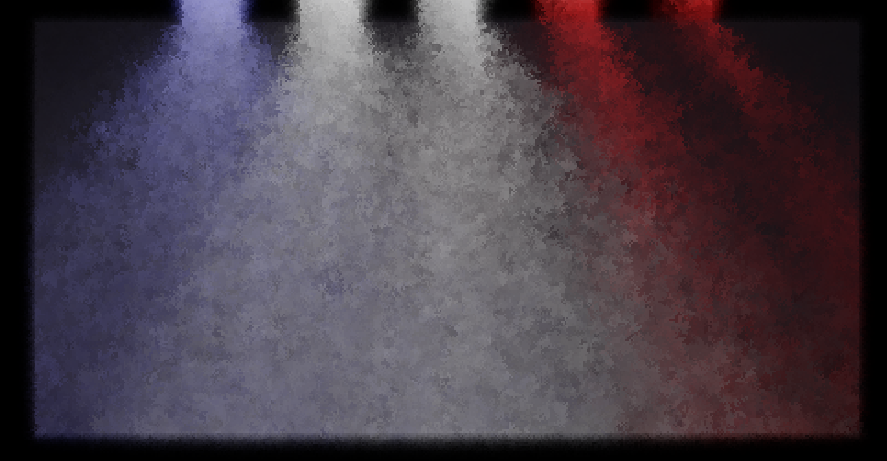

# Amida: 2D Lighting using Radiance Cascades

This program implements 2d lighting using the [Radiance Cascades](https://radiance-cascades.com/) algorithm by Alexander Sannikov, using the bilinear fix to prevent ringing. It also supports multiple bounces using subsurface scattering and volumetrics.

## Usage

Note: This program requires a NVIDIA graphics card due to using CUDA.

Download the [latest release](https://github.com/entropylost/amida/releases/), or compile the program yourself by installing [Rust](https://www.rust-lang.org/), and executing `cargo run`, then call the program:

```
> ./amida.exe world/empty256.tiff env/golden.tiff settings/size256.ron
```

Note that any arguments not provided will be loaded from the default files in the corresponding folder. After opening, the controls are as follows:

- Mouse buttons: Draw walls / light sources. This is configurable in the settings file (which can also add material keybindings). The defaults are:
  - Left: Draw wall
  - Middle: Draw light source
  - Right: Erase
  - Forward: Transparent red wall
  - Backward: Transparent blue wall
- Scroll wheel: Change the radius of the brush.
- Q: Draw using a square brush.
- Enter: Change the merging variant. Options:
  - 0: Stochastic bilinear
  - 1: Nearest
  - 2: Normal bilinear (4x slower)
- B: Change the number of bounces, up to 3.
- S: Save the current scene to a file. Pressing ctrl will overwrite the current file, otherwise a new file with a timestamp will be created.
- L: Reload the scene from the input file.
- Space: Pause the rendering.
- D: Show the difference map.
- E: Change the displayed cascade level.
- R: Show the raw radiance map (because some environments may not have the background be white).
- F: Show the bounce lighting.
- Esc: Close the program.

The .tiff files can be edited using GIMP or Krita - although when exporting, all metadata should be removed. All layers use linear RGB. The layers are:

- `emissive`: The amount of light emitted by pixels. Can be set greater than 1.
- `diffuse`: The diffuse color, used for bouncing. Note that diffuse bouncing is completely rotationally-symmetric, so approximately half of the light will be bounced *into* the object.
- `opacity`: The opacity of materials during bounces.
- `display_emissive`: The amount of added color to the final image.
- `display_diffuse`: The amount of the radiance added to the final image.
- `display_opacity`: The opacity in the final bounce. This is split from `opacity` to allow for light bleeding effects.

This program also supports creating a world from an input image with a palette mapping:

```
> ./amida.exe world/room.png env/default.tiff settings/default.tiff room-palette.ron
```

Will lookup the colors in the image using the mapping in [`room-palette.ron`](./room-palette.ron)

## Known Bugs

- The dpi scaling is broken and has to be manually adjusted. Use the `settings/dpi2.ron` file when having a 2x scaling.

## Gallery




Any contributions to the gallery (or to other parts of this project) would be greatly appreciated.

---

Join the [Radiance Cascades Discord](https://discord.gg/EF9JfcEJPd) for more information and to discuss the algorithm!
